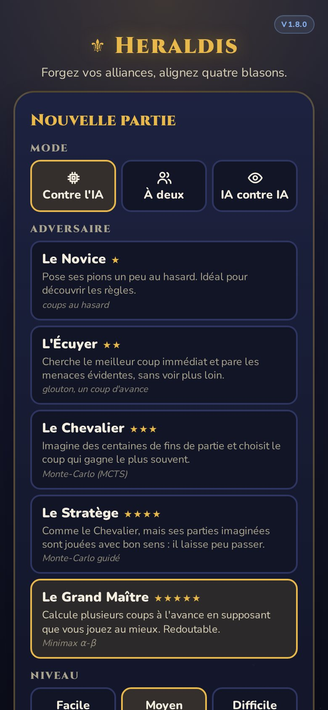
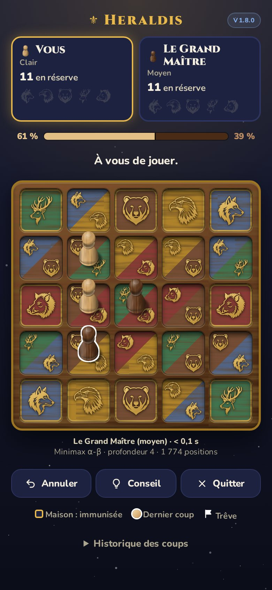
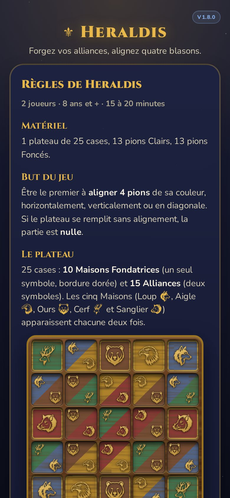

# ⚜ Heraldis

**Forgez vos alliances, alignez quatre blasons.**

Un jeu de société abstrait pour **2 joueurs**, de **Jean-Sébastien MERMIN**.
8 ans et + · 15 à 20 minutes · 1 plateau de 25 cases, 13 pions par joueur.

**[▶ Jouer en ligne](https://noelim111318.github.io/heraldis/)** ·
**[Règles (PDF, 1 page)](https://noelim111318.github.io/heraldis/regles-heraldis.pdf)** ·
[Règles (texte)](REGLES.md)

<p align="center">
  
  
  
</p>

## Le jeu

Le plateau compte 25 cases : **10 Maisons Fondatrices** (Loup, Aigle, Ours, Cerf,
Sanglier, chacune deux fois) et **15 Alliances** qui associent deux Maisons. Chaque
joueur pose à son tour un pion de sa réserve. Le premier qui **aligne 4 pions**
(ligne, colonne ou diagonale) l'emporte.

Ce qui fait le sel du jeu :

- **Les Maisons sont des sièges sûrs** : un pion posé sur une Maison ne peut jamais
  être pris.
- **Les Alliances se conquièrent** : pour prendre un pion adverse sur une Alliance, il
  faut tenir une Maison de *chacun* de ses deux symboles, n'importe où sur le plateau.
  Chaque Maison occupée ouvre donc de nouvelles menaces.
- **Rien ne se perd** : un pion capturé retourne dans la réserve de son propriétaire.
- **Le Premier Serment** : le premier joueur doit ouvrir sur une Alliance, jamais sur
  une Maison.
- **La Trêve** : on ne peut pas reprendre immédiatement une case qu'on vient de perdre.

Règles complètes : [REGLES.md](REGLES.md).

## L'application

Une démonstration jouable, installable sur téléphone, qui fonctionne hors-ligne,
sans publicité ni collecte de données.

- **Contre l'ordinateur**, à **deux** sur le même appareil, ou **ordinateur contre
  ordinateur** pour observer des parties.
- **Cinq adversaires** de force croissante (le Novice, l'Écuyer, le Chevalier, le
  Stratège, le Grand Maître), chacun en trois niveaux.
- **Aides de jeu** facultatives (dernier coup, pions capturables, Trêve,
  coordonnées), **conseil** à la demande, **estimation des chances** de victoire,
  annulation, reprise d'une partie interrompue, statistiques.
- **Règles intégrées** et téléchargeables en PDF.

## Contact

**Jean-Sébastien MERMIN** — [mermin@gmail.com](mailto:mermin@gmail.com)

## Droits

© 2026 Jean-Sébastien MERMIN. **Tous droits réservés.** Le jeu, ses règles et le
code de l'application sont présentés ici à titre de consultation ; toute
reproduction ou exploitation nécessite l'accord écrit de l'auteur. Les
illustrations des Maisons sont des visuels provisoires générés par intelligence
artificielle, destinés à la démonstration.
Détails et composants tiers (polices sous licence libre) : [LICENSE](LICENSE).

---

<details>
<summary>Informations techniques</summary>

Application web progressive (PWA) sans dépendance ni étape de compilation, dans
[`app/`](app/) : moteur de règles, cinq IA (aléatoire, glouton, Monte-Carlo, Monte-Carlo
guidé, minimax alpha-bêta) exécutées en arrière-plan, publication automatique sur
GitHub Pages à chaque mise à jour (`.github/workflows/pages.yml`), après les tests.

```
cd app
python3 -m http.server 8000          # puis http://localhost:8000
node --test tools/tests/*.test.js    # tests des règles et des IA
./tools/check-app.sh                 # contrôle de l'application
```

Notice détaillée : [app/README.md](app/README.md).
</details>
